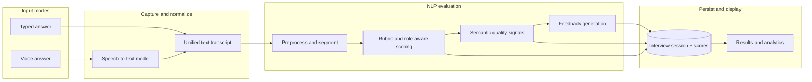

# HireQuest — Project overview

**HireQuest** is a web application for AI-assisted interview preparation: users configure mock interviews, work through questions one at a time, persist progress and flags, and review outcomes on dedicated results views.

Over time, answers are intended to be **evaluated automatically** using **speech-to-text (STT)** where the candidate speaks, and **natural language processing (NLP)** / large language models for semantic scoring, rubric alignment, and coaching feedback. Today the app **captures and stores** answers (primarily as text); automated scoring and spoken-input pipelines are **product direction**—some UI surfaces already reserve space for scores and feedback.

This document summarizes **features**, the **evaluation workflow** (current and target), repository layout, stack, configuration, and operations.

---

## Feature catalog

Features are grouped by area. Status indicates what is typically implemented in-repo versus planned or partially stubbed.

| Status | Meaning |
|--------|---------|
| **Live** | Core flow exists end-to-end in the app |
| **Partial** | UI or APIs exist; deeper automation may be pending |
| **Planned** | Described product behavior; implementation may follow |

### Account and access

- **Live** — Email/password (or configured providers) via NextAuth; session-aware app shell.
- **Live** — Sign-up and sign-in flows aligned with the marketing/auth UX.
- **Live** — Account-related APIs (`/api/account`) for profile and account operations as wired in settings.

### Interview configuration

- **Live** — Create sessions with industry, role category, interview type (technical / behavioral / both), topics, difficulty, question count, and optional timed duration.
- **Live** — Question generation via **Google Gemini** when `GEMINI_API_KEY` is set; **template fallback** when AI is unavailable.
- **Live** — Optional illustrated / visual question assets when image models are configured (see `.env.example`).
- **Live** — Admin-managed **interview config** (`/api/admin/interview-config`) for seeding and maintaining platform defaults.

### Taking an interview (session UX)

- **Live** — **One question at a time** with persisted `currentQuestionIndex`.
- **Live** — **Save Answer** — non-empty answers persisted per question index via `PATCH /api/interviews/[id]`.
- **Live** — **Flag for review** — `flaggedQuestionIndexes` stored in MongoDB; survives refresh and re-entry.
- **Live** — **Next / Previous** — navigation with index persisted server-side; draft text can be saved when moving (implementation detail).
- **Live** — **Finish Interview** — shown when on the last question or when every question has a non-empty saved answer; sets `status: completed` and routes to **results**.
- **Live** — **Session timer** for timed interviews (`durationMinutes`, `interviewStartedAt`).
- **Partial** — **Voice / spoken answers** — dedicated STT capture and attachment of transcripts per answer is **planned** (see workflow below).

### Results and progress

- **Live** — **Results route** per session: `/app/interviews/[id]/results` with summary, questions, answers, and flagged badges.
- **Partial** — **Scores and narrative feedback** — results UI includes placeholders; auto-scoring is **planned** (NLP evaluation pipeline).
- **Live** — **Dashboard and lists** — interviews, completion state, navigation to session or results as appropriate.
- **Live** — **Results overview** page under `/app/results` for aggregated view of sessions.

### App shell and navigation

- **Live** — **Routed dashboard** under `/app/*` with shared layout: navbar, collapsible sidebar, glass-style container.
- **Live** — **Sidebar** — New Interview, Dashboard, Interviews, Results, Analytics, Profile, Billing (includes subscription/invoices), Settings; active state from pathname.
- **Live** — **Theme** — light/dark with persistence; reduced flash on load.
- **Live** — **Offline banner** and **PWA** — installable web app with conservative caching (API network-first).

### Growth and monetization (surface area)

- **Live / Partial** — **Pricing** and **subscription** pages and flows as implemented; exact billing provider integration depends on deployment.
- **Live** — **Analytics** route for usage/insights UI as built.

### Operations and data

- **Live** — **MongoDB** persistence for users, sessions, and interview config.
- **Live** — **Scripts** — `create:admin`, `seed:interview-config`.

---

## Answer evaluation workflow (target architecture)

This section describes how **spoken and written answers** should flow through the system for **fair, explainable evaluation**. It is the intended end-to-end workflow; wiring may be incremental.

### High-level pipeline



### Step-by-step workflow

1. **Question presentation**  
   The candidate sees the current question (and any illustration). Context includes role category, difficulty, and question type—this context is passed forward for evaluation so scores are **role-appropriate**.

2. **Answer capture**

   - **Typed** — The existing answer editor produces a string; optional rich formatting is normalized to plain text for models.
   - **Spoken (planned)** — Audio is recorded client-side (browser or Capacitor). Chunks or the full utterance are sent to a **STT** service (e.g. cloud speech API or streaming recognizer). Output is a **transcript** with optional word-level timestamps for pacing analysis later.

3. **Transcript normalization**

   - Trim, unify whitespace, optional profanity-safe handling for storage policies.
   - Store **both** the raw transcript and the “clean” text used for scoring if policies differ.
   - Associate transcript with `question index` and `session id` (same as answers today).

4. **NLP evaluation (batch or streaming)**

   After each answer—or in batch at **Finish**—the evaluation service runs:

   - **Relevance** — Does the answer address the prompt and constraints?
   - **Structure** — For behavioral: STAR-like structure; for technical: problem decomposition, trade-offs, correctness signals.
   - **Depth** — Appropriate level for stated difficulty.
   - **Communication** — Clarity, concision, hedge words, confidence (when audio prosody is available in later phases).
   - **Safety / policy** — Optional automated checks for disallowed content.

   Implementation options that fit the current stack: **Gemini** (or another LLM) with a **fixed rubric JSON schema** per `interviewType` + `roleCategoryKey`, plus deterministic checks (length, required keywords for drill questions) where useful.

5. **Scoring and feedback artifacts**

   - **Per-question** — Numeric sub-scores, short rationale, and 2–5 **actionable tips**.
   - **Session-level** — Aggregate score, strengths, top gaps, suggested next practice topics.
   - Persist on `InterviewSession` (or a sibling `InterviewEvaluation` document) for history and analytics.

6. **Results UX**

   - Results page merges **saved answers**, **flags**, and **evaluation** into one coherent report.
   - **Planned** — Playback of audio with transcript highlight if voice was used.

7. **Human-in-the-loop (optional later)**

   - Employers or coaches could override or annotate scores; HireQuest would treat model output as **draft** until locked.

### Privacy and compliance (design constraints)

- Audio should be processed under a clear **retention policy** (delete after transcript, or keep for replay only with consent).
- Transcripts and scores are **user data**—export and deletion should follow account deletion flows.
- Model providers should be chosen with **data processing terms** appropriate for your jurisdiction.

### Current code vs this workflow

- **Today** — Answers are **text** in `answers[]`; flags and index persist; results page shows content with **placeholder** scoring/feedback.
- **Next steps (typical)** — Add optional audio upload + STT route; add `POST` (or job) for `evaluate` that writes scores back to the session; extend results UI to render structured evaluation.

---

## Tech stack

| Layer | Choice |
|--------|--------|
| Framework | [Next.js](https://nextjs.org/) 16 (App Router), React 19 |
| Language | TypeScript |
| Styling | Tailwind CSS, Radix UI primitives, Framer Motion |
| Data | MongoDB via Mongoose; [@auth/mongodb-adapter](https://authjs.dev/reference/adapter/mongodb) for NextAuth |
| Auth | [NextAuth.js](https://next-auth.js.org/) v4 |
| AI | Google Gemini (`@google/genai`, `@google/generative-ai`) for question generation; template fallback when API keys are unset |
| Evaluation (planned) | Speech-to-text for voice answers; NLP/LLM rubric scoring and feedback (can reuse Gemini or a dedicated STT provider); structured scores stored on the session |
| Forms / validation | react-hook-form, Zod |
| PWA | [next-pwa](https://github.com/shadowwalker/next-pwa) (service worker disabled in development) |

---

## Repository layout (high level)

```
src/
  app/                 # Next.js App Router: pages + API routes
    api/               # REST handlers (interviews, account, auth, admin interview-config)
    app/               # Authenticated “user app” area (/app/*) with shared shell
    auth/              # Sign-in / sign-up entry
    dashboard/         # Legacy or admin-style dashboard routes (e.g. track-config)
  components/          # UI: marketing sections, dashboard, interview flows, providers
  hooks/               # Client hooks (e.g. useInterviewSession)
  lib/                 # Shared utilities, auth/db helpers
  models/              # Mongoose schemas (User, InterviewSession, InterviewConfig)
scripts/               # create-admin, seed-interview-config
```

---

## User-facing areas

- **Marketing / landing** — Public homepage and related routes under `src/app` (e.g. pricing).
- **Authentication** — `src/app/auth` and NextAuth route `src/app/api/auth/[...nextauth]/route.ts`.
- **Signed-in app (`/app`)** — Layout shell (`AppShell`: navbar, collapsible sidebar, main content). Sidebar items include New Interview, Dashboard, Interviews, Results, Analytics, Profile, Billing, Settings (`SidebarNav`). Nested routes include:
  - `/app/interviews` — list
  - `/app/interviews/[id]` — active session (question flow)
  - `/app/interviews/[id]/results` — completed session outcome
- **Admin / ops** — Interview configuration APIs under `api/admin/interview-config`; separate dashboard paths where applicable.

Interview sessions store questions, `currentQuestionIndex`, answers, optional duration/timer fields, and `flaggedQuestionIndexes`. Updates go through `PATCH /api/interviews/[id]`.

---

## Environment variables

Copy `.env.example` to `.env` and set:

| Variable | Purpose |
|----------|---------|
| `MONGODB_URI` | MongoDB connection string |
| `NEXTAUTH_SECRET` | Secret for JWT/session signing |
| `NEXTAUTH_URL` | Canonical app URL (e.g. `http://localhost:3000` in dev) |
| `GEMINI_API_KEY` | Optional; enables AI-generated questions |
| `GEMINI_MODEL` | Text model name (default `gemini-2.0-flash`) |

Optional Gemini fallbacks and image models are documented in `.env.example`.

When the evaluation pipeline is implemented, document any new keys here (for example speech API credentials, evaluation-specific model overrides, or feature flags for rolling out STT).

---

## Scripts (from `package.json`)

| Command | Description |
|---------|-------------|
| `npm run dev` | Next.js dev server on port **3000** |
| `npm run build` | Production build |
| `npm run start` | Start production server |
| `npm run lint` | ESLint (Next.js config) |
| `npm run create:admin` | Create an admin user (`scripts/create-admin.js`) |
| `npm run seed:interview-config` | Seed interview configuration (`scripts/seed-interview-config.js`) |

---

## Conventions worth knowing

- **Theming** — `ThemeProvider` and `hirequest.theme` in `localStorage`; root layout sets `data-theme` early to reduce flash.
- **Offline / PWA** — Service worker and caching rules in `next.config.js` (assets vs API network-first).
- **Interview UX** — State is driven by routes and API-persisted fields; completed sessions redirect or link to `/app/interviews/[id]/results`.

---

## Related docs

- Root: this file (`PROJECT.md`).

For dependency versions and exact tooling, see `package.json`.
